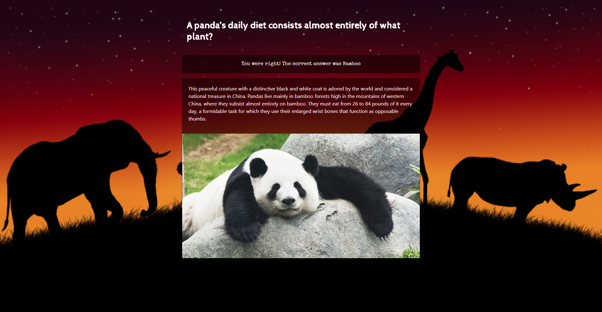

# Animal Facts!

How much do you know about our friends in the animal kingdom? From man's best friend to deadly predators, test your knowledge of our neighbors on this Earth!

## Getting Started

Open up the [project link](https://robertshaw87.github.io/Trivia-Game/) and you should be able to see the example webpage shown below:

Select the difficulty of the questions you want to tackle. Then answer the quiz to the best of your ability and see how well you did. Keep the time limit in mind!

As you learn more about our furry and scaley roommates, play again to see what new questions may arise or challenge yourself to a higher difficulty. 

### Prerequisites

You need to have a modern browser able to handle html5, javascript, and css. 

### Installing

No installation needed! Just open the page in your preferred browser.

## Built With

* Html

* CSS

* [Javascript](https://www.javascript.com/) - The scripting language used

* [BootstrapCDN v4.1.0](https://getbootstrap.com/docs/4.1/getting-started/introduction/) - The web framework used

* [jQuery v3.3.1](http://jquery.com/) - Java library for DOM and CSS manipulation

* [Google Fonts](https://fonts.google.com/) - Font repository

## Authors

* **Robert Shaw** - *Initial work* - [robertshaw87](https://github.com/robertshaw87)
